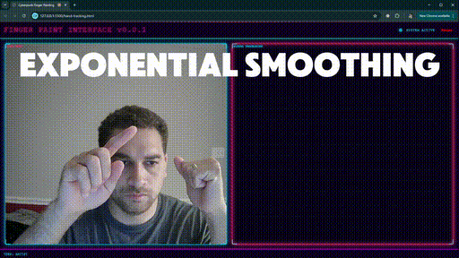

# finger-painting


# How to Download
```
# Clone the respository
git clone https://github.com/gemsjohn/finger-painting.git

# Navigate to the download and add the folder to your code editor's workspace

# Right click and Open with Live Server
```

# How to Use the Application
- Use a modern web browser with WebGL support and a web cam.
- Your left fist is the control. Your right index finger is the pen.
- Open you left first to draw and close your left fist to stop drawing.
- Use your right index finger to draw.

# Support Me
If you get value from this content, consider following me on X [@renderfiction](https://x.com/renderfiction) !