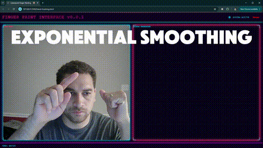

# Finger Painting


# Demo
https://www.renderfiction.com/simulations/finger_painting.html

# How to Download
```
# Clone the respository
git clone https://github.com/gemsjohn/finger-painting.git

# Navigate to the download and add the folder to your code editor's workspace

# Right click finger_painting.html and Open with Live Server
```

# How to Use the Application
**Requirements**
- Use a modern web browser with WebGL support, web cam, and a microphone (if you want to use voice commands).

**Hand Gestures**
- Your left fist is the control. Your right index finger is the pen.
- Open your left first to draw and close your left fist to stop drawing.
- Use your right index finger to draw.

**Voice Commands**
- "Render, change paint color to [color]"
- "Render, export image"
- "Render, erase all"

# Support Me
If you get value from this content, consider following me on **X** [@renderfiction](https://x.com/renderfiction) !

[](https://www.buymeacoffee.com/renderfiction)